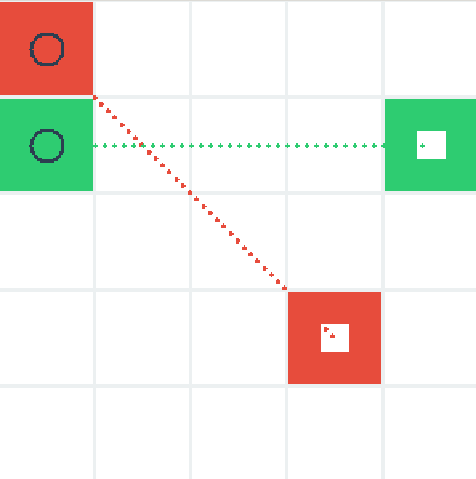
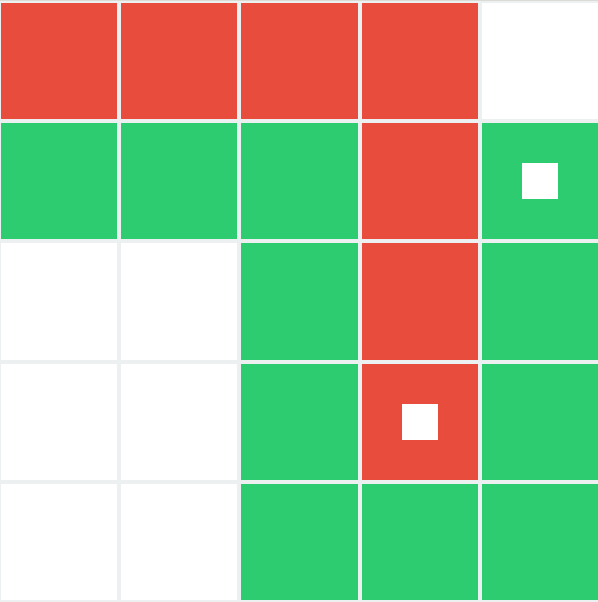
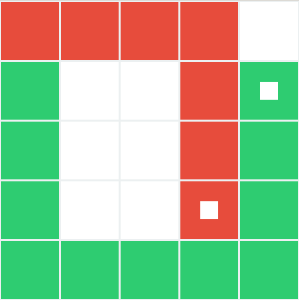
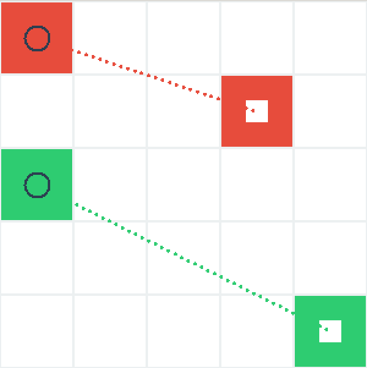

# AI-PROJECT 1 Cross-line Experiment Report  
Zhiqi Chen 2023010958  

## Detailed Design of Search Algorithms  

### I. Problem Background and Objectives  
#### Problem Description  
In an n×n grid, there are m lines, each with a start and end point. Each line's start point must move to its end point through horizontal or vertical moves (one grid at a time, allowing up/down/left/right movement), and the path must not pass through nodes occupied by other lines (except the end point of the current line). The algorithm needs to find a movement strategy that allows all lines to reach their end points while minimizing the path cost (which may include turning penalties, etc.).  

#### Design Principles  
1. Design state representation and transition rules.  
2. Implement heuristic search algorithms using heuristic functions to guide the search direction.  
3. Support two modes: Basic Mode (no turning penalties) and Improved Mode (with turning penalties).  

### II. State Representation and Data Structures  
#### State Definition (`state`)  
The state is a triplet: `[grid, lines, active_line]`  
- `grid`: An n×n matrix recording node occupancy (`0` for empty, `i+1` for the i-th line occupying the node).  
- `lines`: A list of lines, each element is `[start, end]` (coordinates in `[row, column]` format).  
- `active_line`: The index of the current active line (the highest-priority unfinished line, found by searching sequentially for the next unfinished line).  

#### Node Class (`Node`)  
The design of the node class is similar to the example code from the first programming assignment, with slight differences.  

Each node contains:  
- `state`: The current state.  
- `parent`: The parent node (for path backtracking).  
- `action`: The action from the parent node to the current node (formatted as `[line index, new position]`).  
- `path_cost`: Total cost (`g(n) + h(n)`, where `g(n)` is the actual cost and `h(n)` is the heuristic function value).  
- `directions`: The last movement direction of each line (used for calculating turning penalties in Mode 2).  

### III. Action Generation and State Transition  
#### Valid Actions (`actions` method)  
For the current active line, generate valid movement positions among the four adjacent nodes (up/down/left/right) of the start point:  
1. The position is within the grid (`0 ≤ row/column < n`).  
2. The position is not occupied by other lines (unless it is the end point of the current line).  

#### State Transition (`move` method)  
1. Update `grid`: Mark the new position as occupied by the current line.  
2. Update `lines`: Move the start point of the current line to the new position.  
3. Determine the next `active_line`: Search from the next line after the current one; if all subsequent lines are completed, search from the beginning for the next unfinished line.  

### IV. Path Cost Calculation (`g` function)  
#### Basic Cost (Mode 1)  
Each move costs 1, regardless of direction:  
`g(n) = parent's g-value + 1`  

#### Turning Penalty (Mode 2)  
If the current movement direction differs from the previous direction of the line, add an extra cost of 2:  
`g(n) = parent's g-value + 1 + (2 if direction changes)`  
(Use `directions` to record historical directions and determine if a turn occurs.)  

### V. Heuristic Function Design  
The heuristic function `h(n)` estimates the minimum cost from the current state to the target state, with two strategies designed:  

#### Heuristic Function 1: Sum of Manhattan Distances (`h_function_method1`)  
- **Core Idea**: For each unfinished line, calculate the Manhattan distance from start to end, and sum these distances as the heuristic value.  
  Manhattan distance formula: `|start_row - end_row| + |start_col - end_col|`  
- **Mathematical Expression**:  
  $$h(n) = \sum_{i=0}^{m-1} \text{Manhattan}(lines[i][0], lines[i][1])$$  
- **Advantages**: Simple to calculate, guarantees monotonicity (admissibility), suitable for basic search, and ensures finding the optimal solution.  
- **Disadvantages**: Ignores obstacles in the path, potentially leading to lower search efficiency.  

#### Heuristic Function 2: Manhattan Distance + Obstacle Penalty (`h_function_method2`)  
- **Core Idea**: Add penalties for obstacles (nodes occupied by other lines) along the Manhattan paths.  
  1. Generate two Manhattan paths: horizontal-first and vertical-first.  
  2. Count the number of obstacles (excluding the current line's own nodes and end points) on each path.  
  3. Add a penalty of 2 for each obstacle on the path with fewer obstacles.  
- **Mathematical Expression**:  
  $$h(n) = \sum_{i=0}^{m-1} \left( \text{Manhattan}(s_i, e_i) + 2 \times \min(O_h, O_v) \right)$$  
  where $O_h$ and $O_v$ are the number of obstacles on horizontal and vertical paths, respectively.  
- **Advantages**: Incorporates environmental information, reduces invalid searches, and improves heuristic accuracy.  
- **Consistency**: The heuristic is still derived from subproblems of the original problem, ensuring consistency and optimality.  
- **Implementation Details**: See the `.py` file for code.  
  - `generate_horizontal_path`: Move horizontally first, then vertically.  
  - `generate_vertical_path`: Move vertically first, then horizontally.  
  - `count_obstacles`: Count nodes occupied by other lines along the path.  

### VI. Search Algorithm Flow (A* Variant)  
#### Core Logic (`search_generator` function)  
1. **Priority Queue (Open Set)**: Stores nodes to be expanded, sorted by `path_cost = g(n) + h(n)`; the node with the smallest cost is extracted each time.  
2. **Closed Set**: Records visited states to avoid repeated processing.  
3. **Node Expansion**: Generate all valid actions for the current node, create child nodes, and update the queue:  
   - If a child node is unvisited and not in the queue, add it.  
   - If the child node is already in the queue but has a lower cost, update its entry.  

#### Algorithm Steps  
1. **Initialization**: Add the initial state node to the priority queue.  
2. **Loop until the queue is empty**:  
   - Extract the node `current` with the smallest cost.  
   - If `current` is the target state, end the search.  
   - Generate all valid actions and create child nodes.  
   - Prune child nodes (skip if visited or higher cost).  
   - Add valid child nodes to the priority queue.  
3. **Goal Detection**: All lines' start points equal their end points, and there is no active line.  

### VII. Goal Detection and Termination Conditions  
#### Target State Conditions  
1. All lines' start points equal their end points (`start == end`).  
2. `active_line` is `None` (no unfinished lines).  

#### Termination Conditions  
1. Target state found: Return success with `path_cost`.  
2. Queue is empty: Return failure (no feasible solution).  

## Demonstration of Search Algorithm Results  

### VIII. Result Examples  
Take $n=5, m=2$  
Line 1: Start (1,1), End (4,4)  
Line 2: Start (2,1), End (2,5)  

Initial state as shown below:  
{:height="50%" width="50%"}  

1. **Mode 1 (Basic Cost) Search Result**  
   {:height="50%" width="50%"}  
   Cost = 18

2. **Mode 2 (Turning Penalty) Search Result**  
   {:height="50%" width="50%"}  
   Cost = 24  

Both modes found the optimal solution. Other grid layouts can also be tested.  

## Discussion of Search Algorithm Results  

### IX. Analysis of Heuristic Functions  
Using $n=5, m=2$ as an example, analyze the effects of the two heuristic functions.  

#### Example 1:  
{:height="50%" width="50%"}  

##### Mode 1 (Basic Cost)  
- **Heuristic 1 (Manhattan Sum)**: Search steps (number of visited states) = 762  
- **Heuristic 2 (Manhattan + Obstacle Penalty)**: Search steps = 485  

##### Mode 2 (Turning Penalty)  
- **Heuristic 1 (Manhattan Sum)**: Search steps = 261  
- **Heuristic 2 (Manhattan + Obstacle Penalty)**: Search steps = 203  

**This example highlights the advantage of the second heuristic function.** The design intent of the second heuristic is to account for cases where the Manhattan path between two points is blocked by another line's necessary nodes. By adding obstacle penalties, the heuristic encourages early detours, as clearly shown in the reduced search steps.  

#### Example 2 (No Path Intersections):  
{:height="50%" width="50%"}  

##### Mode 1 (Basic Cost)  
- **Heuristic 1**: Search steps = 203  
- **Heuristic 2**: Search steps = 203  

##### Mode 2 (Turning Penalty)  
- **Heuristic 1**: Search steps = 93  
- **Heuristic 2**: Search steps = 93  

**When Manhattan paths of the two lines do not intersect**, both heuristics perform similarly. Here, the second heuristic's obstacle penalty is irrelevant, as no obstacles block the direct paths. Notably, the second heuristic may take longer to compute due to its complexity, making the first heuristic more efficient in such cases.  

**Conclusion**: While the second heuristic excels in most scenarios with potential path obstructions, the first heuristic is simpler and sufficient when paths are naturally obstacle-free. The choice depends on the problem's structural characteristics.